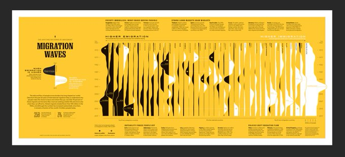

# Projeto Caixa

A ideia deste projeto é analisar o comportamento do caixa e das obrigações financeiras dos órgãos federais, com a finalidade de fornecer informações para a gestão da programação financeira por parte do Tesouro Nacional, além de dentificar oportunidades de melhorias nesse processo.

Vamos elencar aqui alguns aspectos, ou componentes, importantes do projeto, sem uma ordem específica.

### É preciso de início conhecer o perfil das despesas e receitas orçamentárias desses órgãos.

Vamos começar com um perfil das despesas do Ministério da Justiça (que já tem um excelente sistema de acompanhamento das despesas).

Para chamar a atenção, vamos usar um diagrama de bolhas em D3 semelhante [ao do Jim Vallandingham](https://vallandingham.me/bubble_charts_with_d3v4.html).

### Tentar compatibilizar as informações orçamentárias (classificações como função, subfunção, ação, grupo de despesa, indicadores orçamentários etc.) com as informações financeiras (vinculação de pagamento, essencialmente). 

O que estamos chamando de _classificadores orçamentários_: Função, Subfunção, Programa, Ação, Grupo de Despesa, Modalidade de Aplicação, Elemento de Despesa, Indicador de Resultado EOF, Indicador de Exceção Decreto.

O que estamos chamando de _classificadores financeiros_: Vinculação de Pagamento, essencialmente.

A _fonte de recurso_ é um classificador comum a esses dois contextos.

#### Como fazer isso diretamente a partir do Siafi?

Algumas ideias, a serem testadas:

* analisar as despesas pagas, pelos classificadores, pelo número da nota de empenho e pelo número do documento de pagamento; e relacionar documento de pagamento x nota de empenho x vinculação de pagamento pelo campo "inscrição" do documento de pagamento.

* analisar as despesas pagas, pelos classificadores, pelo número da nota de empenho e pelo número do documento de pagamento; e tentar compatibilizar com as informações dos pagamentos efetuados, por vinculação de pagamento e número do documento de pegamento.

* Mais simples: extrair despesas pagas pelos classificadores, empenho e documento de pagamento; buscar vinculação a partir da movimentação do limite de saque por documento (a chave seria o documento de pagamento).

Teríamos então três extrações:

1. Movimentações diárias do Limite de Saque

- Órgão Máximo
- Órgão
- UG
- **Vinculação**
- Fonte
- Documento Lançamento
- Movimento

2. Pagamentos diários

- Órgão Máximo
- Órgão
- UG
- Fonte
- **Função**
- **Subfunção**
- **Programa**
- **Ação**
- **Grupo de Despesa**
- **Modalidade de Aplicação**
- **Elemento de Despesa**
- **Indicador de Resultado EOF**
- **Indicador de Exceção Decreto**
- **Ano do Empenho**
- **Empenho**
- Documento Lançamento
- Movimento

3. Movimentações diáris em obrigações a pagar

- Órgão Máximo
- Órgão
- UG
- Fonte
- **Função**
- **Subfunção**
- **Programa**
- **Ação**
- **Grupo de Despesa**
- **Modalidade de Aplicação**
- **Elemento de Despesa**
- **Indicador de Resultado EOF**
- **Indicador de Exceção Decreto**
- **Ano do Empenho**
- **Empenho**
- Documento Lançamento (talvez nem precise)
- Movimento

#### O que analisar?

Com (1) e (3) obteríamos (i), e teríamos como obter os saldos diários de caixa (por vinculação) e de obrigações a pagar (por classificadores orçamentários), sumarizando por dia de forma a ignorar os documentos de lançamentos, para apurar a disponibilidade financeira líquida diária, para cada unidade analisada.

Com (1) e (2) poderíamos relacionar, no contexto dos pagamentos, as informações orçamentárias às vinculações de pagamento, obtendo (ii). Partiríamos de (2) e faríamos um join com (1), por "Documento de Lançamento", para trazer a "Vinculação de Pagamento".

Finalmente com (1), poderíamos analisar as movimentações para tipo de documento, obtendo um histórico das movimentações, a que chamaremos de (iii).

#### Questões a serem investigadas

a. Qual o comportamento do caixa e das obrigações a pagar no período analisado? Por órgão? Por unidade? Por fonte? Por unidade e por fonte? (i)

b. A partir de (ii), como as classificações orçamentárias se relacionam com as classificações financeiras? Especificamente, que tipos de despesas são pagas com recursos de uma determinada vinculação? Se conseguirmos estabelecer padrões, poderemos então chegar a...

c. A partir de (i), refinar (a), estimando a disponibilidade específica para cada vinculação, considerando as classificações orçamentárias das obrigações. Por exemplo, a unidade tem saldo suficiente para cobrir as obrigações, mas, quando se analisam que vinculações pagam que obrigações (algo obtido de (b)), pode-se observar que na verdade há suficiência em algumas vinculações, mas insuficiência em outras.

d. Qual o comportamento do caixa das unidades? Em geral, quanto tempo se leva para fazer um pagamento após o recebimento do recurso financeiro?

### Analisar os saldos diários do caixa (detalhados por vinculações) e das obrigações financeiras (detalhados por classificações orçamentárias).

Semelhante ao que foi feito [aqui](https://github.com/TesouroNacional/puddles-puddles), só que melhor.

## Inspirações

NatGeo immigrations. Pode ser interessante fazer algo semelhante para visualizar o saldo diário das unidades.

https://twitter.com/aLucasLopez/status/1153646875427385344?s=20
